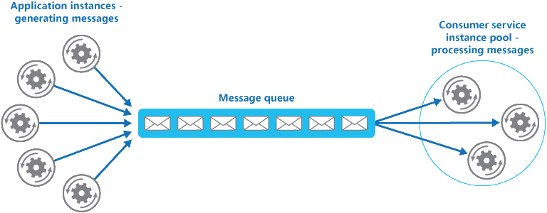
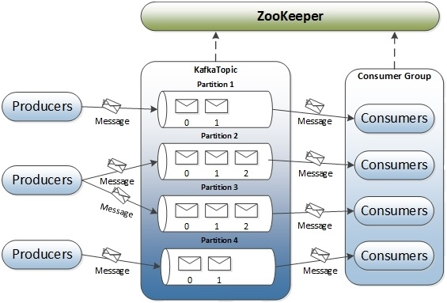
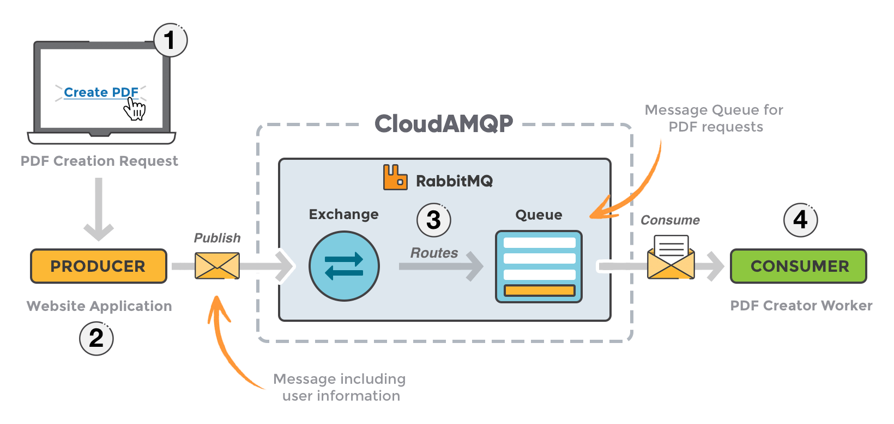

# Message Queues

## Definition

As the name implies, it is a queue of messages. They are used for IPC (inter-process communication), allowing processes can send messages between one another. Processes that send messages to the queue are called **_producers_**. Processes that receive the messages from the queue are called **_consumers_**.

## Basic Architecture
  

  

  
## Benefits
* **_Allows Asynchronous Messaging_** - Processes that don't need a response immediately can send a message, then resume other work as needed (e.g. after you send an email, you wouldn't sit at your computer waiting for a response back).
* **_Provides Decoupling_** - Keeping a queue between processes can decouple the dependencies between the consuming and producing applications.
* **_Easily Scalable_** - The number of messages passed between processes may vary, and consumers may not always be able to process messages immediately. Therefore, the number of consumers, and the queue size, can be scaled as needed.
* **_Higher Performance_** - Ties in with asynchronous messaging. Consumers and producers do not have to wait for responses from each other and can do other things. This can result in faster performance, especially during high traffic/traffic spikes.
* **_Reliable_** - Message queues can help ensure messages are always passed on and processed. If one consuming service is unavailable, another one can take its place and still process the messages as needed.

## Apache Kafka & RabbitMQ

### Similarities
* Both provide message queueing systems (in different ways).
* Neither offers filter/processing capabilities.
* Both solutions run as distributed clusters.

### Differences
* RabbitMQ is broker-centric, focused on delivery guarantees between producers and consumers.
* RabbitMQ ensures queued messages are stored in published order even in the face of requeues or channel closure. 
* Kafka is producer-centeric, based around partitioning a fire-hose of event data into durable message brokers, supporting batch consumers that may be offline, or online consumers that want messages at low latency.
* The whole job of Kafka is to provide the "shock absorber" between the flood of events and those who want to consume them in their own way -- some online, others offline - only batch consuming on an hourly or even daily basis.

|                  | Rabbit MQ              | Apache Kafka       |
|------------------|------------------------|--------------------|
| Open Source      | Mozilla Public License | Apache License 2.0 |
| Language         | Erlang                 | Scala (JVM)        |
| Federated Queues | Yes                    | No                 |
| Scaling Methods  | Vertical               | Horizontal         |

### Terminology
* **_message_** - simple an array of bytes. If we want to send a file to Kafka, we will create a producer application and send each line of the file as a message. A message is one line of text. If we want to send all records of a table, we will send each row as a message. If we want to send the result of a query, we will create producer application, fire a query against my database and start sending each row as a message.
* **_consumer_** - an application that receives data from the server. They can request for data sent by any producer provided that they have permissions to read it.
* **_producer_** - an application that produces data and sends it to the server.
* **_broker_** a Kafka server. Producer and consumer rely on Kafka server as an agent to exchange messages.
* **_kafka cluster_** - simply a group of computers, each executing one instance of Kafka broker.
* **_topic_** - an arbitrary name given to a dataset. It is a unique name for a data stream. A consumer can subscribe to the topic.
* **_offset_** – It is a sequence number of a message in a partition. This number is assigned as the message arrives in a partition. These numbers once assigned never change.
* Global unique Identifier of a message: Topic Name -> Partition Number -> Offset

## Apache Kafka Architecture

  

## RabbitMQ Architecture

  

